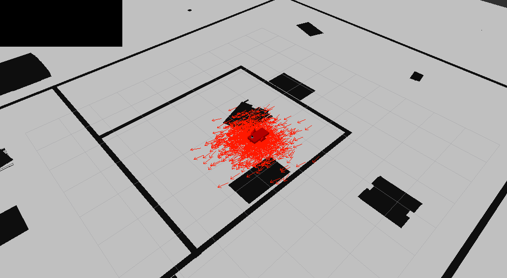
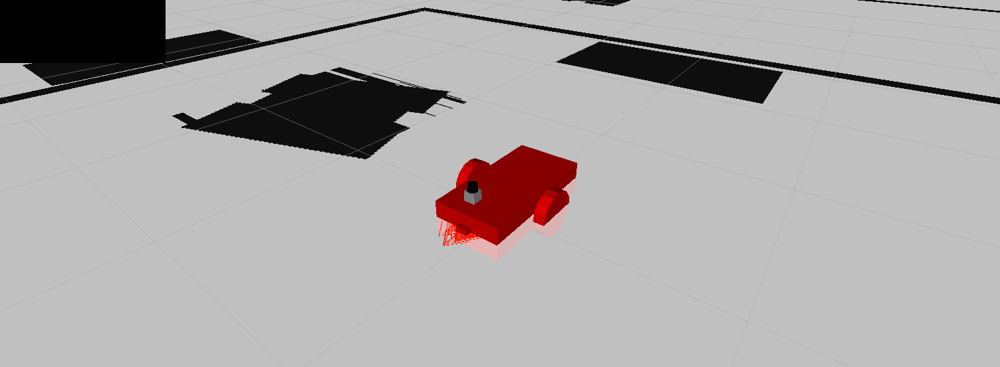
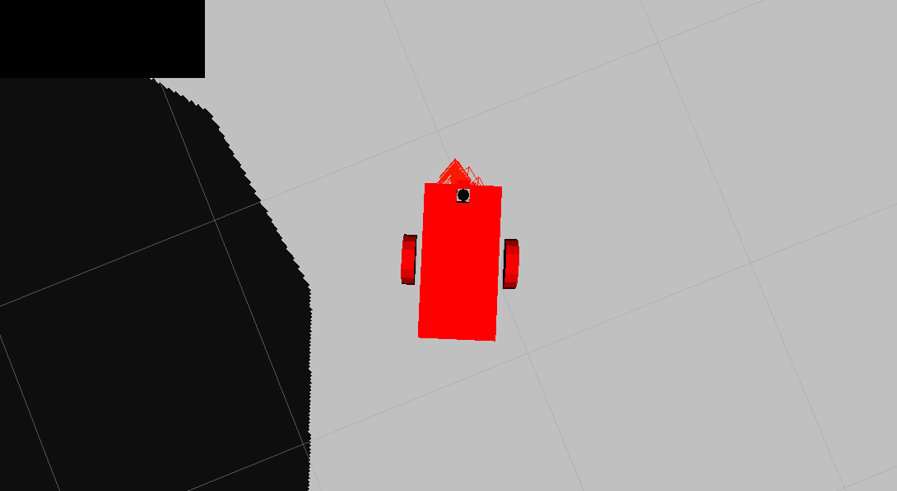

# localization
This project uses ROS AMCL to localise a mobile robot inside a map in the Gazebo simulation environment.
Adaptive Monte Carlo Localization (AMCL) dynamically adjusts the number of particles over a period of time, as the robot navigates around in a map. This adaptive process offers a significant computational advantage over MCL.
The ROS AMCL package implements this variant and is integrated with the robot in this project to localize it within the map created.

## Structure
1)	[Map Server Node](http://wiki.ros.org/map_server): The map_server node provides map data as a ROS service to other nodes such as the amcl node. Here, the map_server node locates the map created and sends it out as the map data. 
2)	[AMCL Node](http://wiki.ros.org/amcl): The amcl node takes odometry and laser scan data to perform the AMCL localization. 
3)	[Move Base Node](http://wiki.ros.org/move_base): The move_base package utilizes a costmap, where each part of the map is divided into occupied areas (e.g. walls, obstacles) and unoccupied areas. As the robot moves around, a local costmap (in relation to the global costmap) is updated which allows the package to define a continuous path for the robot to move along. 

## Screenshots
Image of the static robot upon launch of the simulation: (Note the arrows are initially spread out)


Images of the robot after it starts moving, as seen from a high angle (top) and directly overhead (bottom): (Note the arrows are now very closely aligned)



## Building
Prerequisites/Dependencies: [Gazebo](http://gazebosim.org/) and ROS.
Install the following packages: 
```
$ sudo apt-get install ros-<your_ros_version>-navigation
$ sudo apt-get install ros-<your_ros_version>-map-server
$ sudo apt-get install ros-<your_ros_version>-move-base
$ sudo apt-get install ros-<your_ros_version>-amcl
```

With the prerequisites met, source global ros: 
```
$ source /opt/ros/<your_ros_version>/setup.bash
```
Create a catkin workspace:
```
$ mkdir -p catkin_ws/src && cd catkin_ws
```
Clone the driver:
```
$ git clone https://github.com/barrymulvey/localization.git src/localization
```
Install dependencies:
```
$ sudo apt update -qq
$ rosdep update
$ rosdep install --from-paths src --ignore-src -y
```
Build the workspace:
```
$ catkin_make
```
Activate the workspace:
```
$ source devel/setup.bash
```
Launch the simulation in Gazebo and RViz:
```
$ roslaunch my_robot world.launch
```
Open a new terminal and launch the amcl launch file: 
```
$ cd /home/workspace/catkin_ws/
$ source devel/setup.bash
$ roslaunch my_robot amcl.launch
```

## Testing
Open another terminal and launch the teleop script: 
```
$ cd /home/workspace/catkin_ws/
$ source devel/setup.bash
$ rosrun teleop_twist_keyboard teleop_twist_keyboard.py
```
Another option, instead of using the teleop node, is to send a 2D Navigation Goal directly from RViz. In the RViz window, click on the "2D Nav Goal" toolbar button. Then, click and drag on the map to send the goal to the robot. The robot will start moving and localize itself in the process.
